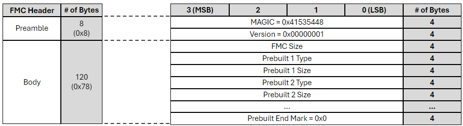
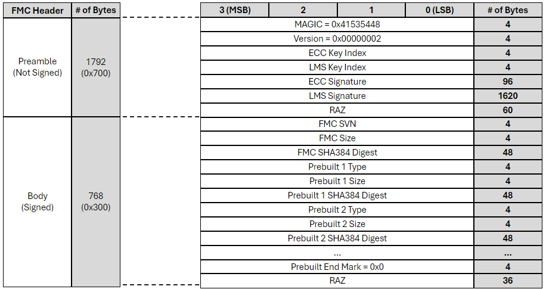

# ASPEED FMC_IMGTOOL

ASPEED FMC image tool is to pack the SoC FMC image with the header for runtime FW load, including FW itself and the prebuilt binaries in AST27xx series.

# Requirement

- python v3.7.0 and above

# Usage

```
usage: main.py [-h] --input IN --output OUT --version {1,2} [--svn SVN] [--ecc-key KEY] [--ecc-key-index IDX] [--lms-key KEY] [--lms-key-index IDX] [--verbose]

optional arguments:
  -h, --help           show this help message and exit
  --input IN           input FMC raw binary
  --output OUT         output FMC binary with header
  --version {1,2}      FMC header version
  --svn SVN            FMC security version number, Default=0
  --ecc-key KEY        ECDSA384 signing key (.pem)
  --ecc-key-index IDX  ECDSA384 signing key index hint, Default=0
  --lms-key KEY        LMS signing key (.prv)
  --lms-key-index IDX  LMS signing key index hint, Default=0
  --verbose            show detail information
```

## FMC Header Format - v1

- This header format is used in AST2700-A0 to load the prebuilt binaries.


## FMC Header Format - v2

- This header format is used in AST2700-A1 ROM for secure boot and FMC for loading and verifying the prebuilt binaries.


### Command Usage

- FMC + Header
```
$ python3 main.py --version 2 --input fmc_raw.bin --output fmc.bin
```

- FMC + Header + ECC Signature
```
$ python3 main.py --version 2 --input fmc_raw.bin --output fmc.bin --ecc-key pri.pem --ecc-key-index 0
```

- FMC + Header + ECC Signature + LMS Signature
```
$ python3 main.py --version 2 --input fmc_raw.bin --output fmc.bin --ecc-key pri.pem --ecc-key-index 0 --lms-key lms_key.prv --lms-key-index 0​
```